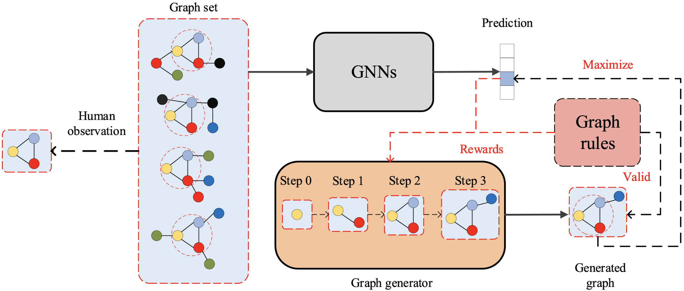
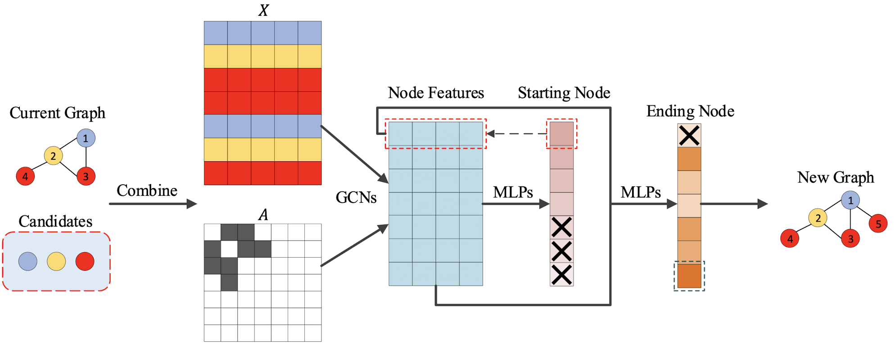
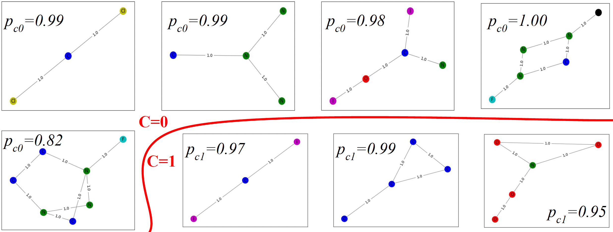

# XGNNs: Model-level Explanation of Graph Neural Networks with RL through Graph Generation

#### Copyright © 2024 Alessio Borgi, Francesco Danese

The project aim is to explore advanced methodologies for **interpreting Graph Neural Networks (GNNs)** at a **Model-level** granularity. By leveraging a **graph generation** approach, this work aims to produce human-interpretable patterns that reveal how GNNs make decisions, by individuating, in particular, network motifs that are uniquely defining a certain class. The MUTAG dataset, a widely used benchmark for graph classification, serves as the primary dataset to demonstrate these techniques. This technique, can be used with **ANY Graph Neural Network**!

---


## Overview

### Why Interpretability Matters
**Graph Neural Networks (GNNs)** have emerged as a leading framework for tasks involving structured data such as social networks, biological molecules, and recommendation systems. Despite their performance, the inherent complexity of GNNs often renders them opaque, raising trust and usability issues. Chemistry, medicine, and social sciences applications in critical domains demand transparency and interpretability to ensure ethical and informed decision-making.

This project addresses this challenge by implementing **XGNN**, a framework that provides **model-level explanations** for GNNs. Instead of offering example-specific insights, XGNN uncovers general patterns and structures that GNNs rely on during predictions. These insights help:
- Validate whether the model aligns with domain knowledge.
- Build user trust by highlighting interpretable decision-making patterns.
- Identify biases or inconsistencies for iterative model improvement.


## Architecture

<div style="text-align: center">
  
</div>

### Graph Neural Network (GNN)
The backbone of this project is a **Graph Convolutional Network (GCN)**, which processes graph data through node feature aggregation and transformation. Key aspects of the GNN architecture include:
1. **Input Representation**:
   - Graphs are represented by adjacency matrices and node feature matrices.
   - MUTAG nodes are labeled with one-hot encoding to denote atom types.
2. **Feature Propagation**:
   - Node features are updated by aggregating information from neighboring nodes.
   - The GCN layers use activation functions such as ReLU to introduce non-linearity.
3. **Graph-Level Representation**:
   - After multiple GCN layers, node embeddings are aggregated using **global pooling** to produce a fixed-dimensional graph embedding.
4. **Classification**:
   - A fully connected layer maps the graph embeddings to class probabilities.

### Graph Generator for Explanations
<div style="text-align: center">
  
</div>

The graph generator is a critical component. It employs reinforcement learning to iteratively build graphs that maximize the GNN's confidence for a specific class. Features include:
1. **Graph Initialization**:
   - The process starts with a single node, such as a carbon atom for MUTAG.
2. **Action Space**:
   - Actions include adding edges or introducing new nodes from a predefined candidate set.
3. **Policy Network**:
   - A GCN-based policy network predicts actions to extend the graph.
4. **Reward Mechanism**:
   - Rewards combine model feedback (e.g., class prediction probabilities) and compliance with graph rules (e.g., valency constraints).

### Reinforcement Learning for Graph Generation
The graph generation process is modeled as a **Markov Decision Process (MDP)** with:
- **States**: Partially constructed graphs.
- **Actions**: Adding nodes/edges while adhering to graph constraints.
- **Rewards**: Encouraging valid, interpretable graphs that maximize the target class prediction score.

## Features

### Interpretability through Graph Generation
By generating human-intelligible graph patterns, this project demonstrates how GNNs make predictions. For example:
- **Mutagenic Graphs**:
  - Contain motifs like carbon rings and NO2 groups, consistent with chemical mutagenicity.
- **Non-mutagenic Graphs**:
  - Feature halogen atoms such as Chlorine, Bromine, and Fluorine.

### Flexibility for Multiple Applications
While this project focuses on MUTAG, the framework can be adapted to other datasets and domains (e.g., social networks, protein interaction networks).

## Experimental Insights

### MUTAG Dataset
The MUTAG dataset represents chemical compounds as graphs:
- **Nodes**: Atoms (Carbon, Nitrogen, Oxygen, etc.).
- **Edges**: Chemical bonds.
- **Classes**: Mutagenic vs. Non-mutagenic compounds.

#### Training the GNN
- **Accuracy**: The trained GNN achieves high accuracy on the MUTAG dataset, indicating strong predictive performance.
- **Node Aggregation**: Three layers of GCN capture complex interactions between atoms.

#### Generating Explanations
- The graph generator identifies motifs that the GNN uses for classification:
  - **Carbon Rings**: Indicate mutagenicity.
  - **Chlorine-Focused Structures**: Indicate non-mutagenicity.

### Results Overview

The figure illustrates the ability of our RL-enhanced Graph Neural Network (GNN) framework to generate molecular graphs while respecting specific structural properties. Each panel represents a molecular graph generated with a classification probability \(p_{c0}\) or \(p_{c1}\) corresponding to the probability of belonging to class \(C=0\) or \(C=1\), respectively.

- **Top Row** (\(C=0\)): These graphs exhibit high classification probabilities for class \(C=0\), ranging from \(p_{c0} = 0.82\) to \(p_{c0} = 1.00\). This indicates that our model effectively captures molecular structures characteristic of this class.
- **Bottom Row** (\(C=1\)): Similarly, the graphs generated for class \(C=1\) achieve high classification probabilities (\(p_{c1} = 0.95\) to \(p_{c1} = 0.99\)), demonstrating the framework's capacity to learn and replicate the features of this class.
- **Structural Patterns**: The connectivity patterns and node types in the graphs align with the chemical rules and class-specific features, showcasing the GNN's capability to maintain molecular validity and class distinction during generation.

This visualization highlights the success of our approach in combining RL and GNNs for controllable and class-specific graph generation, particularly in molecular datasets like MUTAG.

<div style="text-align: center">
  
</div>

### Generalization Beyond MUTAG
- The generator's modularity ensures it can handle datasets with different graph rules and structures.
- Patterns discovered in one dataset can inform domain-specific improvements or broader scientific hypotheses.

### Prerequisites

Install the required dependencies:
```bash
pip install torch numpy networkx matplotlib
